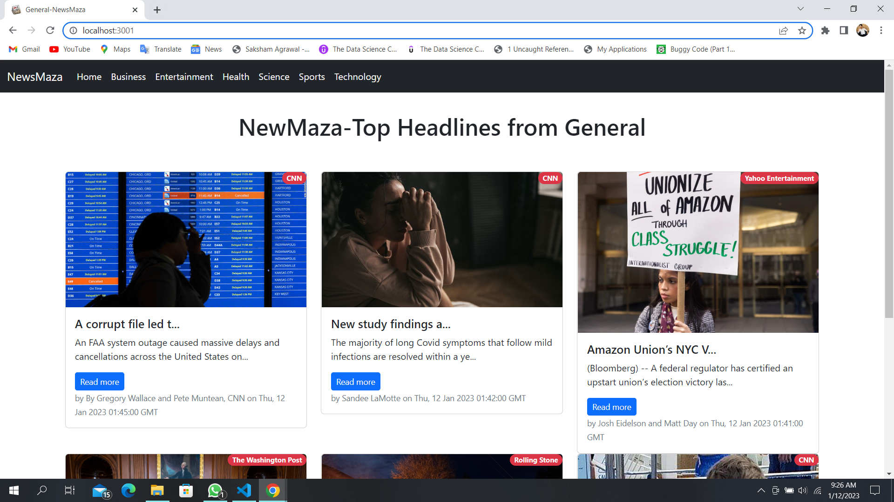
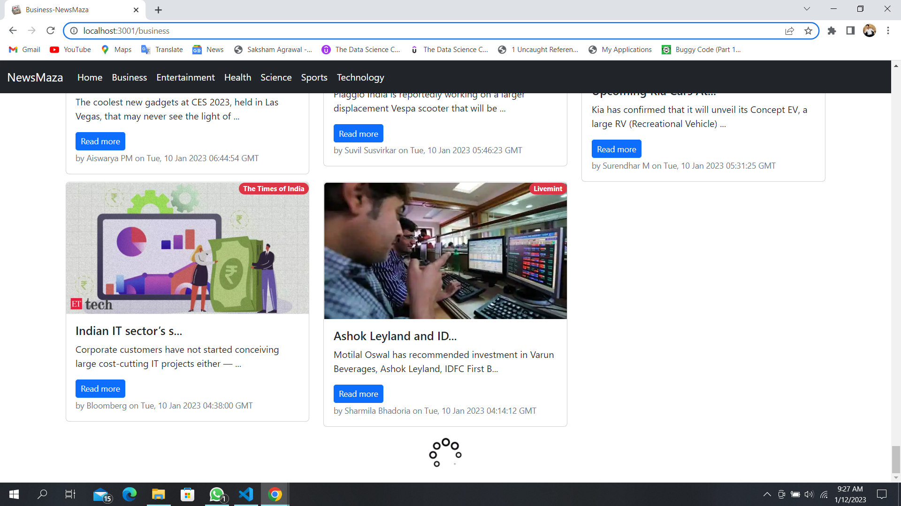

# THIS is My Project using React.js

My project name is NewsMaza which is made using React.js and BootStrap and the component were made using class base component.

## About this Project
>NewsMaza is a web App for getting daily News
>NewsMaza having diffrent category for diffrent News that help to user to filter the News
>NewsMaza in live on gitHub page but due to router there is some issue while fatching the api in local server it work properly
>NewsMaza having infinite scroll for users.

>in future i will change its component from class based component to function based component i made class based component for only learning purpose only.

# Here some Images on Webpage

